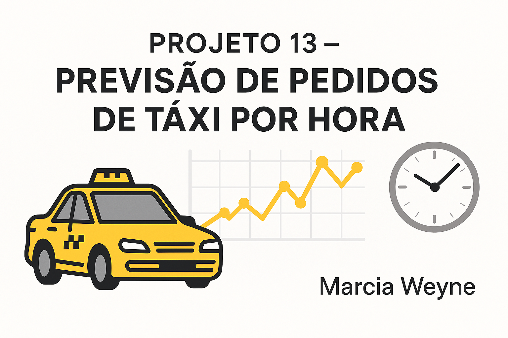

🚖 Projeto 13 – Previsão de Pedidos de Táxi por Hora  
Autora: Marcia Weyne  
Data: 2025

📝 Descrição do Projeto  
Este projeto foi desenvolvido para a empresa fictícia **Taxi Corrida Maluca**, que deseja prever a demanda de pedidos de táxi nos aeroportos. O objetivo é construir um modelo de machine learning capaz de prever o número de pedidos de táxi para a próxima hora com alta precisão, otimizando a alocação de motoristas durante horários de pico.

---

## 📑 Tabela de Conteúdo  
- Objetivo  
- Resultados  
- Ferramentas Utilizadas  
- Metodologia  
- Como Executar o Projeto  
- Aprendizados  
- Contato

---

## 🏔 Objetivo  
Criar um modelo de machine learning para prever a quantidade de pedidos de táxi por hora, com base em dados históricos coletados nos aeroportos, garantindo que a métrica RMSE seja inferior a 48.

---

## 🏁 Resultados  
- 📊 Reamostragem dos dados para intervalos de 1 hora  
- 🧠 Engenharia de atributos com variáveis de atraso (lags) e médias móveis  
- 🤖 Modelos testados: Regressão Linear e Random Forest  
- ✅ RMSE final no conjunto de teste abaixo de 48  
- 🔍 Identificação do modelo com melhor desempenho para predição horária

---

## 🧰 Ferramentas Utilizadas  
- Linguagem: Python  
- Ambiente: Jupyter Notebook  
- Bibliotecas: pandas • numpy • scikit-learn • matplotlib • seaborn  
- Versionamento: Git + GitHub  
- Editor: VS Code

---

## 🔍 Metodologia  

1. **Preparação dos Dados**  
   - Conversão do índice de tempo  
   - Reamostragem para frequência horária  
   - Visualização de padrões de comportamento

2. **Engenharia de Atributos**  
   - Extração de hora e dia da semana  
   - Criação de variáveis defasadas (lags)  
   - Cálculo de médias móveis

3. **Modelagem**  
   - Treinamento dos modelos:  
     - Regressão Linear  
     - Random Forest  
   - Divisão entre treino, validação e teste  
   - Avaliação com RMSE

4. **Conclusão**  
   - Comparação de modelos  
   - Escolha do modelo final com base no desempenho no conjunto de teste

---

## 💽 Como Executar o Projeto  

**Pré-requisitos:**  
- Python 3.10 ou superior  
- Jupyter Notebook instalado

**Instale as dependências:**  
```bash
pip install -r requirements.txt
```

**Execute:**  
```bash
jupyter notebook
```

Abra o notebook `sprint_13_previsao_taxi.ipynb` e siga as etapas descritas.

---

## 📝 Aprendizados  

**Técnicos:**  
- Aplicação de técnicas de séries temporais em machine learning  
- Implementação de variáveis defasadas e médias móveis  
- Avaliação com RMSE em conjunto de teste

**Profissionais:**  
- Estruturação de projeto de forma clara e replicável  
- Uso de Git e GitHub para controle de versão e portfólio  
- Apresentação objetiva de resultados com foco na métrica alvo

---

## 😄 Contato  

Marcia Weyne  
📫 mbweyne@gmail.com  

[](https://github.com/mbweyne/projeto_13_previsao_pedidos_taxi) 
 
[](https://www.linkedin.com/in/marcia-bayardino-weyne)
